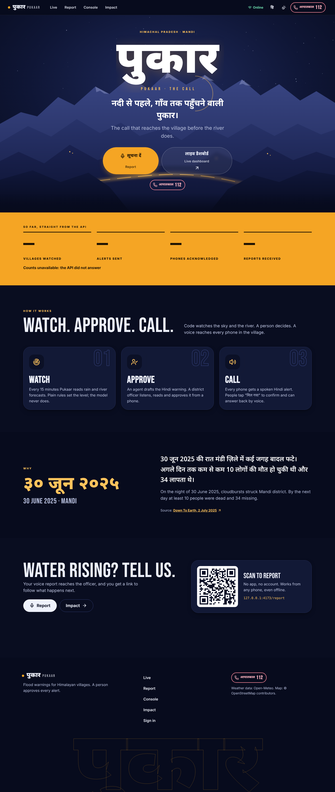
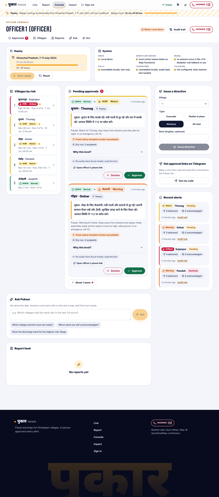
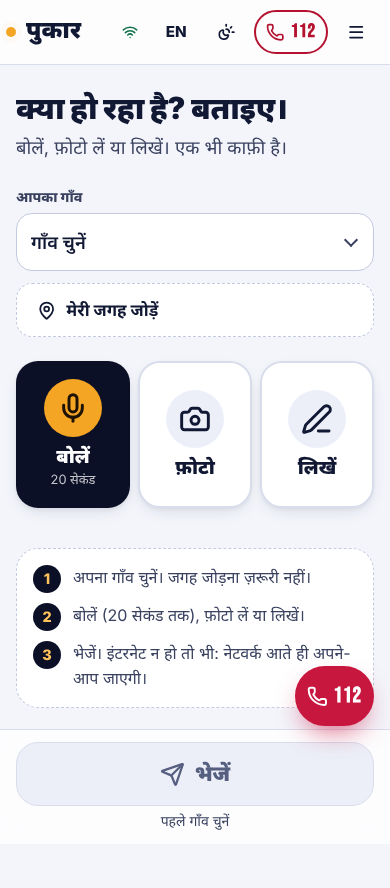
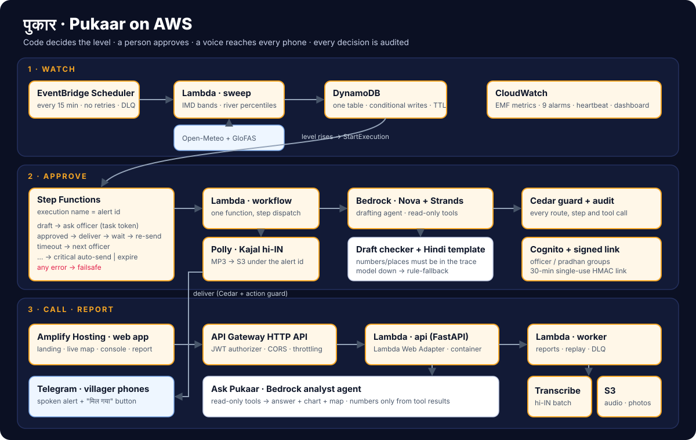

# Pukaar (पुकार)

**The call that reaches the village before the river does.**

Pukaar is a flood-warning loop for Himalayan villages, built on AWS. A
15-minute sweep watches rain and river forecasts. Plain code sets a risk
level. A Bedrock agent drafts a Hindi alert, and a district officer approves
it with one tap. Villagers then hear the alert as a spoken message on their
phones, tap "मिल गया" (got it), and can report back by voice.

Built for Environmental Hacks (WeMakeDevs x AWS), Heat and Water track.

**Live:** https://main.d15r7ktz99l46x.amplifyapp.com · deployed on AWS (`us-east-1`, stack `pukaar-dev`) · public pages need no sign-in.

| Landing | Officer console | Villager report (phone) |
|---|---|---|
|  |  |  |

## The problem

In the hill districts of Himachal Pradesh a mountain stream can become a
flood within hours, often at night. On the night of 30 June to 1 July 2025,
cloudbursts struck Mandi district; early official figures were at least 10
people dead and 34 missing
([Down To Earth](https://www.downtoearth.org.in/natural-disasters/cloudbursts-devastate-himachals-mandi-at-least-10-dead-34-missing-after-1900-excess-rain-on-july-1)).

Forecasts exist, but they are numbers on a website, not a warning a villager
hears. Even when an official sees the danger in time, there is no quick way to
send a spoken Hindi warning to every household and know who heard it. Pukaar
is built around the gaps between a forecast and a family moving to high ground:

| Gap | What Pukaar does about it |
|---|---|
| The forecast never becomes a decision for one village | Every 15 minutes, code turns rain and river forecasts into a level per village, from IMD rain bands and that village's own 1984-2024 river record |
| A text message can be missed, unread or in the wrong language | The alert is spoken Hindi (Polly), delivered to the phone with the text |
| A broadcast never says who heard it | Each phone taps "मिल गया"; anyone who has not is sent the alert again, and the live page shows the funnel from draft to acknowledgement |
| An AI could invent a number or a place in a warning | Code sets the level and the recipients; the model only fills a fixed Hindi template, and a checker rejects any number or place not in the decision trace |
| The one officer on duty may be asleep | Unanswered approvals move to the next officer; a critical alert with nobody answering goes out with the fixed template and is flagged unapproved |
| Global models can miss a cloudburst (they did in the 2025 back-test below) | A verified villager report can raise a level on its own |

Try it in two minutes: open the [live page](https://main.d15r7ktz99l46x.amplifyapp.com), scroll the landing page through "the night the river rose" (Gohar, July 2023, replayed through the real rules), then open **Live** for the 3D village map.

## Who it is for

- **District and block disaster officers**: they approve every alert on their
  phone and see who acknowledged it.
- **Village pradhans**: they see their own village's reports and alerts.
- **Villagers**: they need no account. They hear alerts on Telegram, tap
  once to confirm, and report from any phone browser, even offline.

## What happens, moment by moment

| Moment | What Pukaar does | AWS service |
|---|---|---|
| Every 15 minutes | For five villages, read forecast rain (next 24 h) and river discharge (next days) | EventBridge Scheduler -> Lambda `sweep` |
| A threshold is crossed | Code sets the level: IMD rain bands, each village's own 1984-2024 discharge percentiles, two-source agreement, verified reports; hysteresis on the way down | Lambda, DynamoDB (conditional writes, dedupe per 15-minute window) |
| The level rises | An approval workflow starts, one per alert | Step Functions (Standard, `waitForTaskToken`) |
| Drafting | A Strands agent reads the decision trace through read-only tools and fills a fixed Hindi template; a checker rejects any number or place not in the trace | Bedrock (Amazon Nova) via Strands Agents; Cedar hook on every tool call |
| Voice | The Hindi text becomes speech | Polly (Kajal, hi-IN), MP3 in S3 |
| Approval | The officer gets a signed one-tap link (30 min, single use) and a console entry; no answer moves to the next officer; a critical alert with no answer goes out unapproved and is flagged | Step Functions timeouts, Cognito, Cedar |
| Delivery | Spoken alert plus text and a "मिल गया" button; one automatic re-send to anyone who has not acknowledged | Lambda, Telegram Bot API |
| A villager reports | Voice, photo or text, from any phone; queued offline; a tracking code back | API Gateway, S3, Transcribe (hi-IN), Bedrock |
| Verification | Code verifies a report when GPS is inside the village and a second report agrees nearby, or the photo matches | Lambda |
| An officer asks | "Which villages need attention?" gets an answer, a chart and a map built from tool data | Bedrock agent with read-only tools |
| Every decision | Allow or deny, with the policy and reason, in an append-only audit log | Cedar (`cedarpy`), DynamoDB |
| Operations | Alarms on model errors, failover, workflow failures, DLQs, a missing sweep heartbeat, delivery failures and unacknowledged alerts; one dashboard | CloudWatch (embedded metric format) |

Three rules hold everywhere:
- **Code decides, the model words.** The model never sets a level, never decides to send and never picks who receives an alert.
- **A model outage still alerts.** If Bedrock is down, the fixed Hindi template goes out and the alert records `rule-fallback`.
- **Replay is always labelled.** Replay data is real archived data, it carries `replay: true` everywhere, and it never reaches a real phone.

## Architecture



<details><summary>Text version</summary>

```
 EventBridge Scheduler ──15 min──> Lambda sweep ──> DynamoDB (one table, sparse GSI)
        Open-Meteo forecasts ─────┘      │ level rises
                                         v
                      Step Functions approval workflow ──> Lambda workflow steps
              draft (Bedrock agent + checker + Polly) -> ask officer (task token,
              signed link) -> deliver (Cedar + action guard) -> wait -> re-send -> close
                    timeout -> next officer -> critical auto-send | expire
                    any error -> failsafe
                                         │
 Officer phone / console (Amplify) <── API Gateway HTTP API + Cognito ──> Lambda api (FastAPI)
 Villager phone: Telegram voice alert, "मिल गया"  <── Telegram Bot API
 Villager report: web form -> S3 -> Lambda worker (Transcribe, Bedrock) -> verify -> sweep
```

</details>

### AWS in depth

Every row is deployed in stack `pukaar-dev` (`us-east-1`) and defined in
[infra/template.yaml](infra/template.yaml).

| Service | What it does in Pukaar | How it is set up | Code |
|---|---|---|---|
| **EventBridge Scheduler** | Runs the sweep every 15 minutes | `rate(15 minutes)`, `MaximumRetryAttempts: 0` (a late sweep is useless; the next one comes), dead-letter queue `pukaar-sweep-dlq-dev` | `infra/template.yaml` (`SweepSchedule`) |
| **Lambda** (4 functions, container images from one Dockerfile) | `pukaar-api-dev` (FastAPI behind the Lambda Web Adapter, 2048 MB, 29 s), `pukaar-sweep-dev`, `pukaar-workflow-dev` (one function, dispatch on `step`), `pukaar-worker-dev` (Transcribe, replay) | X-Ray tracing on every function, one IAM role per function, 30-day log retention | `backend/Dockerfile`, `backend/src/Pukaar/handlers/` |
| **API Gateway HTTP API** | Every route | Cognito JWT authorizer on the catch-all route; an explicit short list of public routes (health, overview, report, acknowledgement, signed approval link, Telegram webhook); CORS limited to the web origin; stage throttling 20 req/s, burst 50 | `infra/template.yaml` (`HttpApi`) |
| **Step Functions** (Standard) | One approval execution per alert: draft, ask officer, deliver, wait, re-send, close | `waitForTaskToken` callbacks with the timeout as a deploy parameter; `States.Timeout` moves to the next officer; `States.ALL` on every task goes to a failsafe; 2-hour execution limit; error-level logging; X-Ray | [infra/approval.asl.json](infra/approval.asl.json), `backend/src/Pukaar/workflow/steps.py` |
| **DynamoDB** | All state in one table | On-demand, `pk`/`sk`, one sparse GSI used as the open-work queue, TTL, point-in-time recovery, conditional writes for sweep dedupe and single-use approval tokens; audit rows are append-only | `backend/src/Pukaar/store/repo.py` |
| **Bedrock** (Amazon Nova 2 Lite, via Strands Agents) | Drafts the Hindi alert, structures reports, describes photos, answers officers ("Ask Pukaar") | Typed output, at most 4 turns, a fresh agent per call; whole-call retry in `us-west-2` on throttling, 5xx or timeouts; every tool call passes a Cedar hook; any failure returns `None` and the rule fallback runs | `backend/src/Pukaar/llm/bedrock.py`, `backend/src/Pukaar/llm/tools.py` |
| **Polly** | Speaks every approved alert in Hindi | Voice Kajal, `hi-IN`, generative engine with a logged fallback to neural, MP3 stored in S3 under the alert id | `backend/src/Pukaar/voice/polly.py` |
| **Transcribe** | Turns villager voice reports into text | `hi-IN` batch job; the audio stays in S3 next to the transcript, so a failed transcription never loses a report | `backend/src/Pukaar/voice/transcribe.py` |
| **Cognito** | Officer and pradhan sign-in | User pool with groups `officer` and `pradhan` and a `village_ids` attribute; villagers need no account | `infra/template.yaml`, `scripts/seed_users.py` |
| **S3** | Alert audio, report photos and audio | Private, all public access blocked, SSE-S3, TLS-only bucket policy, presigned URLs | `backend/src/Pukaar/services/storage.py` |
| **SSM Parameter Store** | Telegram token, webhook secret, approval-link signing key | SecureString, read at start-up, never in an environment variable or the template | `scripts/put_secrets.sh` |
| **SQS** | Dead-letter queues for the sweep and the worker | SSE-SQS, 14-day retention, each with an alarm | `infra/template.yaml` |
| **CloudWatch** | Logs, metrics, nine alarms, one dashboard | Embedded metric format; alarms for model errors, model failover, API 5xx, failed approvals, both DLQs, a missing sweep heartbeat, failed deliveries and unacknowledged alerts; SNS topic for alarm e-mail | dashboard `pukaar-dev` |
| **Amplify Hosting** | Serves the web app | Manual deploy of the Vite build with the stack's outputs baked in | `scripts/deploy_web.sh` |
| **AWS Open Data (Terrain Tiles on S3)** | Real Himalayan relief for the 3D map and the landing-page valley | Terrarium tiles from `s3://elevation-tiles-prod`; the landing heightmap is baked once from them | `frontend/src/components/VillageMap.tsx`, `backend/src/Pukaar/scripts/story.py`, `scripts/build_hero_dem.py` |
| **AWS Budgets** | Keeps the hackathon cheap | Monthly cost budget with e-mail alerts at 80% actual and 100% forecast | account level |

### Guarantees the tests enforce

[backend/tests/test_template_safety.py](backend/tests/test_template_safety.py)
parses the real template on every test run and fails if:
- any IAM statement allows `*` or a whole service (`s3:*`);
- any statement grants a `"*"` resource for an action AWS allows to be scoped;
- the template contains anything billed by the hour (NAT gateway, EC2, RDS, OpenSearch, Kendra, load balancers and more);
- the table loses point-in-time recovery, TTL or on-demand billing; a log group loses its retention; the bucket stops being private, encrypted and TLS-only; a queue loses encryption; or the sweep schedule starts retrying.

[backend/tests/test_asl.py](backend/tests/test_asl.py) checks the state
machine itself: approve, decline, timeout to the next officer, critical
auto-send and a forced error into the failsafe.

### What it costs

Nothing runs between requests: no servers, no NAT gateway, no database
instance. At demo traffic the stack stays almost entirely inside the AWS free
tier. The parts that cost money even when small are Bedrock tokens (no model
call at level Normal), Polly and Transcribe after their free tiers, and ECR
storage for the two container images. A monthly budget alarm watches the
account.

Infrastructure as code: [infra/template.yaml](infra/template.yaml) (AWS SAM),
state machine [infra/approval.asl.json](infra/approval.asl.json).

## Built versus planned

| Piece | State |
|---|---|
| Sweep, risk rules, hysteresis, dedupe | Built and tested offline |
| Approval workflow (approve, decline, timeout, next officer, critical auto-send, failsafe) | Built; state machine path-tested offline |
| Bedrock drafting with checker and rule fallback | Built; tested with a scripted model |
| Polly voice, Telegram delivery, acknowledgement, re-send | Built; needs a bot token for a real phone |
| Voice and photo reports, Transcribe, auto-verification, tracking | Built |
| Cedar roles, audit log, agent tool guard | Built and tested |
| Ask Pukaar analyst agent | Built (falls back to a keyword router without a model) |
| Replay and back-test on archived data | Built ([data/backtest.json](data/backtest.json)) |
| Web app: landing, live map, officer console, village, report, track, approve, impact | Built (see `frontend/`) |
| Deployed stack on AWS | **Live** since 11 Oct 2026: stack `pukaar-dev`, web app on Amplify. Checked live: Cognito sign-in, a replay on AWS starting real Step Functions approval executions, an officer approval moving an alert to delivered, and Polly writing the Hindi MP3 to S3. Steps: [docs/DEPLOY.md](docs/DEPLOY.md) |
| Bedrock on the live stack | Model access is being enabled; until then drafts go out from the fixed Hindi template and are labelled `rule-fallback` |
| Telegram on the live stack | Waiting for a bot token; alerts use the stub channel until then |
| Spoken approval, grounded voice Q&A, safe-places map, AgentCore, CAP export | Planned (stretch) |

## What the back-test shows (and what it does not)

The replay runs archived hours through the same code. Rain is the archived
forecast (Open-Meteo historical forecast API). Discharge is the archived
GloFAS series from the Open-Meteo flood API.

- **7-11 July 2023:** Sujanpur, Gohar and Pandoh reach critical, and Thunag
  and Janjehli reach watch.
- **30 June to 1 July 2025, Mandi:** the archived forecasts gave at most
  14-34 mm in 24 hours at four of the villages, and discharge never crossed
  even the 90th percentile at four of five villages. **The global models
  missed the cloudburst.** Thresholds were not tuned to fake a hit. This is
  why a verified villager report can raise a level on its own.

Not yet measured:
- Real-world lead time. Replay discharge stands in for a perfect forecast, so
  the replay's lead times are optimistic.
- Delivery and acknowledgement rates on real phones.
- Transcribe accuracy on Himachali Hindi.
- False-alarm rate over a full monsoon.

## Data sources

- Village coordinates: Open-Meteo geocoding (GeoNames). Not verified on the ground.
- Rain forecasts: Open-Meteo forecast API and historical forecast API.
- River discharge and its 1984-2024 history: Open-Meteo flood API (GloFAS).
- Rain bands: India Meteorological Department 24-hour categories (64.5, 115.6 and 204.5 mm).

No populations, casualty figures or other numbers are invented. Unknown
values stay empty.

## Run it locally (no AWS account needed)

```bash
make install   # uv + npm
make local     # API on :8000 (local mode: in-process AWS mock), web on :5173
```

Open http://localhost:5173. Sign in as `officer1` and press "Start replay".
Local mode runs the whole loop with an in-process mock of DynamoDB and S3 and
a threaded copy of the state machine. Bedrock, Polly and Transcribe are not
mocked, so you see the rule fallbacks.

Tests:

```bash
make test      # backend pytest (offline) + frontend vitest + build
```

Deploy to AWS: [docs/DEPLOY.md](docs/DEPLOY.md).

## More

- [DEMO.md](DEMO.md): the demo click path, with a fallback for each risk.
- [docs/RESILIENCE.md](docs/RESILIENCE.md): what happens when each part fails.
- [docs/CONTRACT.md](docs/CONTRACT.md): API routes and shapes.
- [PLAN.md](PLAN.md), [PROGRESS.md](PROGRESS.md), [DECISIONS.md](DECISIONS.md), [SCORECARD.md](SCORECARD.md), [CODEMAP.md](CODEMAP.md).

## AI tools used

Built with Claude Code (Anthropic). Claude wrote most of the code under
human direction; reviewer agents with no memory of the build graded each
piece (SCORECARD.md).

## Acknowledgements

<!-- To be written by the team before submission. -->

Emergency number in India: **112**.
